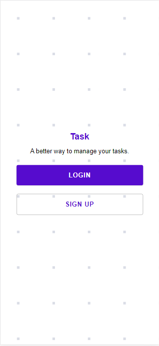
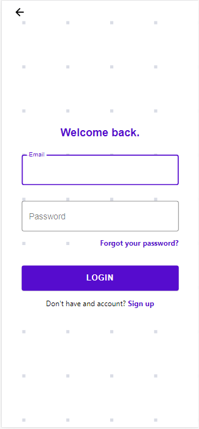
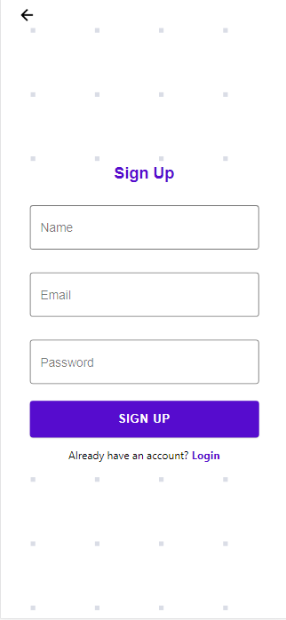
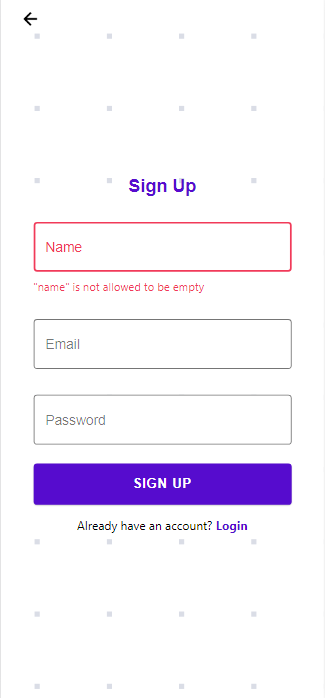
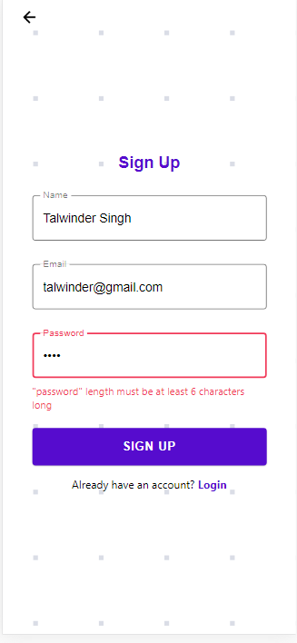
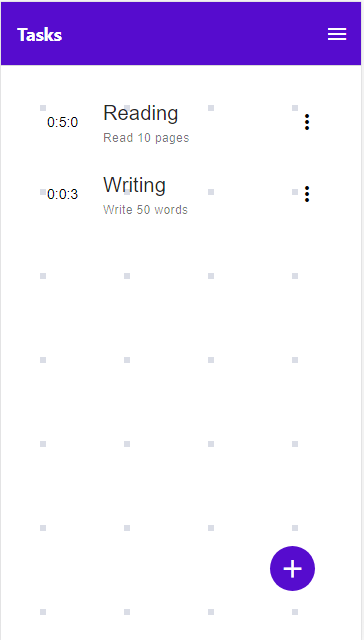
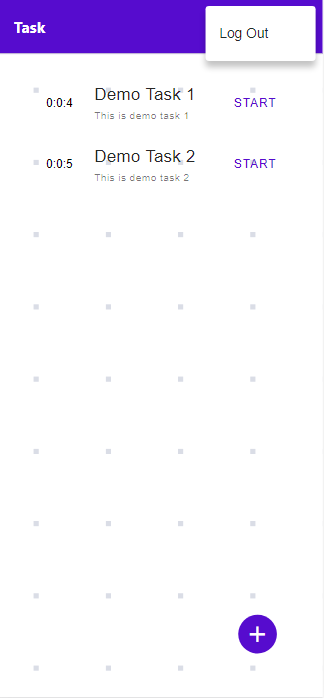
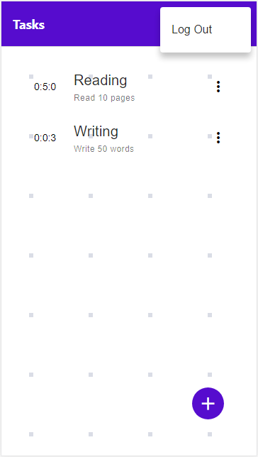
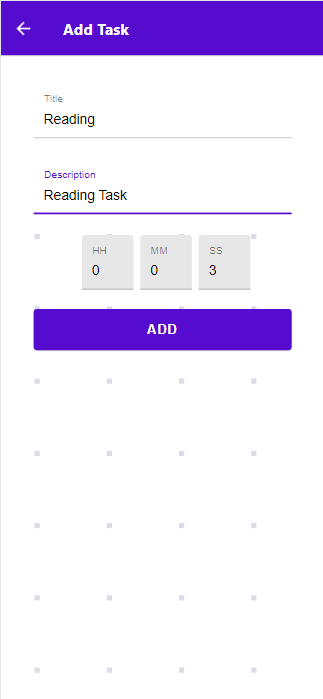
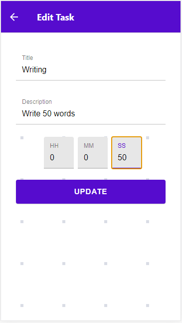

  <h3 align="center">Task</h3>

# Screenshots

## Start Screen

  

## Login Screen

  

## Signup Screen

  

  

  

## Dashboard Screen

  

  

  

## Add Task Screen

  

## Edit Task Screen

  

